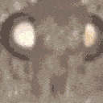
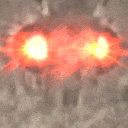
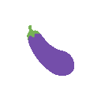
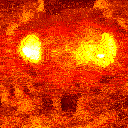

# ezrgif

**NOTE**: I have since rewritten this tool in Go as [yeetgif](https://github.com/sgreben/yeetgif). This repo is no longer maintained.

[](https://quay.io/repository/sergey_grebenshchikov/ezrgif)

GIF effects from the command-line. (A `sh` wrapper around `imagemagick` and the `giflossy` fork of `gifsicle`)


<!-- TOC -->

- [Get it](#get-it)
    - [Docker image (easiest)](#docker-image-easiest)
    - [From source](#from-source)
        - [Install prerequisites (Mac)](#install-prerequisites-mac)
        - [Install prerequisites (linux)](#install-prerequisites-linux)
- [Use it](#use-it)
    - [Docker image](#docker-image)
    - [From source](#from-source-1)
- [Examples](#examples)
    - [Pulse+wobble+optimize](#pulsewobbleoptimize)
    - [Wobble](#wobble)
    - [Woke+optimize](#wokeoptimize)
- [Effects](#effects)
    - [roll](#roll)
    - [wobble](#wobble)
    - [pulse](#pulse)
    - [zoom](#zoom)
    - [shake](#shake)
    - [woke](#woke)
    - [fried](#fried)
    - [optimize](#optimize)

<!-- /TOC -->

## Get it

### Docker image (easiest)

Pull & tag:

```sh
docker pull quay.io/sergey_grebenshchikov/ezrgif
docker tag quay.io/sergey_grebenshchikov/ezrgif ezrgif
```

You can now simply `docker run -i ezrgif`.

### From source

You can also just get the [gif.sh](https://raw.githubusercontent.com/sgreben/ezrgif/master/gif.sh). This probably starts up a bit faster than the Docker option, but you need to take care of the dependencies yourself.

```sh
$ curl -sSL https://raw.githubusercontent.com/sgreben/ezrgif/master/gif.sh > gif
$ chmod +x gif
```

As to the dependencies: you will need to install `imagemagick`, as well as the `--lossy` fork of `gifsicle`:

#### Install prerequisites (Mac)

```sh
$ brew install imagemagick giflossy
```

#### Install prerequisites (linux)

See [Dockerfile](Dockerfile)

## Use it

### Docker image

```sh
$ docker run --rm -i ezrgif -h
Usage:
    gif.sh [ -s DEFAULT_FINAL_SIZE ] (roll | wobble | pulse | zoom | shake | woke | fried | optimize) [ -h ] [ OPTIONS ]
defaults:
        DEFAULT_FINAL_SIZE=128x128
```

### From source

```sh
$ ./gif -h
Usage:
    gif.sh [ -s DEFAULT_FINAL_SIZE ] (roll | wobble | pulse | zoom | shake | woke | fried | optimize) [ -h ] [ OPTIONS ]
defaults:
        DEFAULT_FINAL_SIZE=128x128
```

## Examples

If you're using Docker, put this in your shell aliases:

```sh
$ alias gif="docker run -i --rm ezrgif"
```

### Pulse+wobble+optimize

```sh
$ <doc/moth.png gif pulse -0 1.0 -1 1.5 -n 20 | gif wobble -d 3x100 -p 100% -c 100% | gif optimize > doc/moth.gif
```



### Wobble

```sh
$ <doc/eggplant.png gif wobble -c 60% -n 20 > doc/eggplant.gif
```


### Woke+optimize

```sh
$ <doc/moth.png gif woke -f -n 10 -y -15 -z 60% | gif optimize > doc/woke.gif
```



## Effects

### roll


```text
roll [-p PAD_TO] [ -c CUT_TO ] [ -d DELAY ] [ -n NUM_FRAMES ] [ -r REVOLUTIONS ] [ -s FINAL_SIZE ] INPUT
defaults:
    PAD_TO=200%
    CUT_TO=50%
    DELAY=2x100
    NUM_FRAMES=1
    REVOLUTIONS=1
    FINAL_SIZE=128x128
```

### wobble


```text
wobble [-p PAD_TO] [ -c CUT_TO ] [ -d DELAY ] [ -n NUM_FRAMES ] [ -a AMPLITUDE ] [ -f FREQUENCY ] [ -s FINAL_SIZE ] INPUT
defaults:
    PAD_TO=200%
    CUT_TO=50%
    DELAY=2x100
    NUM_FRAMES=1
    AMPLITUDE=8
    FREQUENCY=1
    FINAL_SIZE=128x128
```

### pulse


```text
pulse [-p PAD_TO] [ -c CUT_TO ] [ -d DELAY ] [ -n NUM_FRAMES ] [ -0 SCALE_MIN ] [ -1 SCALE_MAX ] [ -f FREQUENCY ] [ -s FINAL_SIZE ] INPUT
defaults:
    PAD_TO=200%
    CUT_TO=50%
    DELAY=2x100
    NUM_FRAMES=1
    SCALE_MIN=0.5
    SCALE_MAX=1.0
    FREQUENCY=1
    FINAL_SIZE=128x128
```

### zoom



```text
zoom [-p PAD_TO] [ -c CUT_TO ] [ -d DELAY ] [ -n NUM_FRAMES ] [ -0 SCALE_MIN ] [ -1 SCALE_MAX ] [ -e POWER ] [ -s FINAL_SIZE ] INPUT
defaults:
    PAD_TO=200%
    CUT_TO=50%
    DELAY=2x100
    NUM_FRAMES=1
    SCALE_MIN=0.5
    SCALE_MAX=1.0
    POWER=2.0
    FINAL_SIZE=128x128
```
### shake


```text
shake [-p PAD_TO] [ -c CUT_TO ] [ -d DELAY ] [ -n NUM_FRAMES ] [ -x AMPLITUDE_X ] [ -y AMPLITUDE_Y ] [ -f FREQUENCY_X ] [ -g FREQUENCY_Y ] [ -o PHASE_Y ] [ -r PHASE_RANDOM ] [ -s FINAL_SIZE ] INPUT
defaults:
    PAD_TO=200%
    CUT_TO=50%
    DELAY=2x100
    NUM_FRAMES=1
    AMPLITUDE_X=10
    AMPLITUDE_Y=10
    FREQUENCY_X=2
    FREQUENCY_Y=2
    PHASE_Y=pi/2
    FINAL_SIZE=128x128
    PHASE_RANDOM=pi
```

### woke


```text
woke [ -f | -v ] [ -m MODE ] [ -n FLARE_FRAMES ] [ -x FLARE_X ] [ -y FLARE_Y ] [ -z FLARE_SCALE ] [ -a FLARE_ALPHA ] [ -r FLARE_ANGLE_RANDOM ] [ -t FLARE_TRANSFORM ] [ -d DELAY ] [ -s FINAL_SIZE ] INPUT
defaults:
    MIRROR_X=0
    MIRROR_Y=0
    MODE=linear-light
    FLARE_FRAMES=
    FLARE_X=-33
    FLARE_Y=-5
    FLARE_SCALE=90%
    FLARE_ALPHA=0.5
    FLARE_ANGLE_RANDOM=30
    FLARE_TRANSFORM=0
    DELAY=2x100
    FINAL_SIZE=128x128
available -m modes:
    Atop, Blend, Blur, Bumpmap, ChangeMask, Clear, ColorBurn, ColorDodge, Colorize, CopyAlpha, CopyBlack, CopyBlue, CopyCyan, CopyGreen, Copy, CopyMagenta, CopyRed, CopyYellow, Darken, DarkenIntensity, DivideDst, DivideSrc, Dst, Difference, Displace, Dissolve, Distort, DstAtop, DstIn, DstOut, DstOver, Exclusion, HardLight, HardMix, Hue, In, Intensity, Lighten, LightenIntensity, LinearBurn, LinearDodge, LinearLight, Luminize, Mathematics, MinusDst, MinusSrc, Modulate, ModulusAdd, ModulusSubtract, Multiply, None, Out, Overlay, Over, PegtopLight, PinLight, Plus, Replace, Saturate, Screen, SoftLight, Src, SrcAtop, SrcIn, SrcOut, SrcOver, Stereo, VividLight, Xor,
```

### fried



```text
fried [ -d DISTORT ] [ -c CUT_TO ] [ -o COLOR ] [ -t TINT ] [ -b BLACK_POINT ] [ -w WHITE_POINT ] [ -u SATURATION ] [ -l LOSS ] [ -m COLORS ] [ -s FINAL_SIZE ] [ INPUT ]
defaults:
    DISTORT_X=0
    DISTORT_Y=0
    DISTORT=0.5
    CUT_TO=60%
    COLOR=orange
    TINT=80%
    SATURATION=150
    BLACK_POINT=25
    WHITE_POINT=85
    COLORS=133
    LOSS=3000
    FINAL_SIZE=128x128
```

### optimize

```text
optimize [ -g TARGET_GEOMETRY ] [ -s TARGET_SIZE_KB ] [ INPUT ]
defaults:
    TARGET_GEOMETRY=128x128
    TARGET_SIZE_KB=128
```
